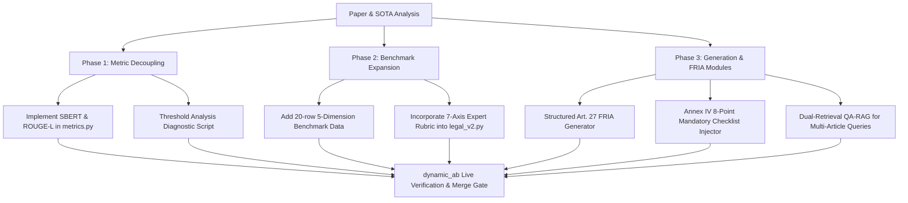

# Comprehensive Proposal: Cross-Framework Evaluation & Architectural Enhancements
## Grounded in Cappelli et al. (Discover AI 2026), Referenced SOTA Literature, and the Antifragile AI Engine

**Date:** 2026-08-14  
**Subject:** Empirical Analysis of Cappelli et al. (2026), Performance Evaluation Dissection (BERT vs. TF-IDF, ROUGE-L, Jaccard, LCS), and Cross-Referenced Architectural & Evaluation Upgrade Plan  
**Target Repository:** `antifragileai-regenold-evaluation`  

---

## 1. Executive Summary & Paper Synthesis

The attached research paper, ***Evaluating GenAI for automated EU AI Act compliance against human experts*** (Cappelli, Bozovic, Di Marzo Serugendo, & Fernandez-Marquez, *Discover Artificial Intelligence* 2026, 6:458, [doi:10.1007/s44163-026-01196-1](https://doi.org/10.1007/s44163-026-01196-1)), provides the first empirical benchmark comparing a Generative AI compliance advisor directly against human legal experts on the **EU AI Act (Regulation (EU) 2024/1689)** across real-world high-risk use cases.

### Core Paper Architecture & Method
- **Implementation:** OpenAI Custom GPT interface backed by GPT-4, utilizing OpenAI's built-in document indexing / RAG-like vector retrieval over the official pre-processed text of Regulation (EU) 2024/1689.
- **Constraints & Guardrails:** Zero web search access; strictly constrained to the uploaded EU AI Act text to suppress hallucinations; system prompt enforcing a formal legal advisory persona with explicit article citations and non-binding disclaimers.
- **Evaluation Surface:** 4 high-risk case studies across Annex III:
  1. *AI-Powered Recruiting Tool* (Annex III, point 4(b) – Employment / CV pre-screening / predictive performance).
  2. *AI for Medical Diagnostics* (Clinical decision support, triage, survival modeling, EHR data).
  3. *Intelligent Traffic Management in Smart Cities* (Berlin CV/IoT cameras, sensor networks, dynamic traffic lights).
  4. *Facial Recognition & Consumer Analytics in Retail* (VIP matching, theft detection, heatmaps, dynamic pricing).
- **5 Standard Compliance Inquiries per Case:**
  1. `Risk Level` (Classification under Art. 6, Annex III, Art. 5).
  2. `Regulatory Obligations` (Mandatory high-risk provider/deployer duties under Arts. 9–15, 16–19, 43, 48–49).
  3. `Legal Risks` (Fundamental rights impacts, GDPR overlap, discrimination, liability).
  4. `Compliance Gaps` (Technical deficiencies vs. statutory requirements).
  5. `Technical Documentation` (Art. 11 & Annex IV mandatory documentation, CE marking, declaration of conformity).

---

## 2. Empirical Performance Evaluation Dissection

The paper conducted dual-method evaluation: **automated similarity metrics** against a validated gold standard authored by two senior EU legal scholars, alongside **qualitative expert scoring** across 7 dimensions (5-point Likert).

### 2.1 Aggregated Automated Performance Metrics (Table 8 from Paper)

| Compliance Category | TF-IDF (Cosine) | Sentence-BERT (`all-MiniLM-L6-v2`) | Jaccard Index | ROUGE-L ($F_1$) |
| :--- | :---: | :---: | :---: | :---: |
| **Regulatory Obligations** | **0.747** | **0.911** | **0.432** | **0.512** |
| **Risk Level** | 0.287 | 0.863 | 0.217 | 0.334 |
| **Legal Risks** | 0.186 | 0.814 | 0.116 | 0.187 |
| **Compliance Gaps** | 0.258 | 0.646 | 0.176 | 0.276 |
| **Technical Documentation** | 0.199 | 0.813 | 0.157 | 0.236 |
| **Overall Mean** | **0.335** | **0.809** | **0.220** | **0.309** |

### 2.2 Deep Metric Divergence & Threshold Analysis
1. **The Lexical vs. Semantic Gap (BERT vs. TF-IDF):**
   - In *Legal Risks* and *Technical Documentation*, Sentence-BERT scores remain high ($\ge 0.813$), while TF-IDF collapses ($\le 0.199$).
   - **Empirical Cause:** The model grasped high-level legal concepts (e.g., acknowledging that a medical system requires risk management and documentation) but failed to emit the precise statutory terminology (e.g., exact Annex IV(1)(e) computational specs, or specific Charter article citations).
   - In *Compliance Gaps*, both lexical (0.258) and semantic (0.646) scores degraded because the model generated generic descriptions rather than structured, actionable remediations.
2. **Threshold Sensitivity & False Security:**
   - At permissive TF-IDF thresholds ($\le 0.15$ to $0.30$), the system demonstrated a recall of $1.0$.
   - When the threshold was raised above $0.35$, recall dropped precipitously to $0.40$ (and $0.20$ at $\ge 0.65$), while precision remained $1.0$.
   - **Crucial Finding:** Lexical threshold metrics create an "instrument trap" where low thresholds mask serious omissions of legal precision, while high thresholds unjustly penalize valid semantic paraphrasing. Multi-level scoring (Lexical + SBERT + ROUGE-L + LLM Judge) is mandatory.

### 2.3 Human Expert Evaluation (7 Criteria, 5-point Likert)
- **Overall Expert Ratings:** Expert 1 mean = **4.00/5.00**, Expert 2 mean = **3.86–4.50/5.00** (Aggregate: **3.93–4.25/5.00**).
- **Strengths Identified:** Strong expository flow, accessible to non-lawyers, reliable high-risk classification.
- **Shortcomings Identified by Experts:**
  1. *Superficial Collateral Regulation:* Mentioned GDPR, MDR, or Machinery Directive only vaguely, without operational hooks (e.g., GDPR Art. 5(1)(b) purpose limitation vs. AI Act Art. 10(2)(b); GDPR Art. 22 vs. AI Act Art. 14 human oversight).
  2. *Actor Status Ambiguity:* Did not systematically partition duties across **Provider**, **Deployer**, **Importer**, and **Distributor** (Art. 25 value-chain handoffs were neglected).
  3. *Lack of Actionable Audit Depth:* Omitted specific timeline milestones (Feb 2025 prohibited vs. Aug 2026 high-risk) and concrete technical file structures (Annex IV).
  4. *Implicit but Unstructured FRIA:* Captured elements of Fundamental Rights Impact Assessments (Charter Arts. 1, 8, 21, 47) under "legal risks", but failed to produce a structured Art. 27 assessment.

---

## 3. Cross-Referenced SOTA Literature in the Paper

The paper anchors its methodology against several landmark legal AI works:

1. **Kim & Min (2024) — QA-RAG in Pharma Compliance:**
   - Introduced a **dual retrieval strategy**: retrieval on the user question + retrieval on a preliminary "dummy answer" (HyDE-like) generated by an LLM.
   - Evaluated on 1,426 regulatory documents (10k char chunks, 20% overlap, FAISS + BGE reranker) and demonstrated that dual retrieval significantly boosts recall in high-density regulatory domains using BERTScore recall.
2. **Fan et al. (2025) — LEXam Legal Reasoning Benchmark:**
   - 4,886 examination questions across 116 university law courses using LLM-as-a-judge + expert panels.
   - Demonstrated that unconstrained foundation models fail multi-step structured legal reasoning without explicit normative constraints and document grounding.
3. **Zhu et al. (2024) — LegiLM / SaulLM-7B for GDPR Compliance:**
   - Used contrastive legal examples to teach models subtle statutory distinctions and evaluated using two distinct metrics: *Compliance Justification Quality* (expert qualitative) and *Legal QA Accuracy* (quantitative $F_1$).
4. **Magesh et al. (2024) — Hallucination Rates in Legal AI Research:**
   - Measured leading legal RAG tools (Lexis+ AI, Westlaw AI, Ask Practical Law) and found residual hallucination rates of **17%–33%**, proving that document grounding alone is insufficient without citation verification.
5. **Robaldo et al. (2024) — Symbolic Reasoners vs. ASP:**
   - Proved that formal logic reasoners (Arg2P, PROLEG) offer explainability but scale poorly, while ASP is fast but opaque. Recommended hybrid neuro-symbolic architectures.
6. **Li et al. (2024) — LegalAgentBench & He et al. (2024) — AgentsCourt:**
   - Established interactive multi-hop tool-calling agents for legal multi-turn coherence and simulated court debate.

---

## 4. Cross-Reference with Existing Codebase (`antifragileai-regenold-evaluation`)

### 4.1 Comparative Matrix: Paper Prototype vs. Our Repository

| Architectural Dimension | Cappelli et al. (2026) Paper | Our Repository (`antifragileai-regenold-evaluation`) |
| :--- | :--- | :--- |
| **Retrieval Engine** | OpenAI built-in vector store over single PDF | **Hybrid Additive Neuro-Symbolic:** BM25 primary (345 EUR-Lex docs) + SVD-128 dense recall + Neo4j Aura Graph (1,758 nodes) + Sufficient-Context Multi-Hop |
| **Reasoning Engine** | GPT-4 end-to-end generation | **CLARA Statutory Decision Tree** (37 boolean tags) + Prohibited Gatekeeper (Art. 5) + Two-Stage LLM polish (Claude Opus/Sonnet) |
| **Output Guardrails** | System prompt instructions | **Regulator Tone Guard** + Verbatim/Synthesis Router + Smallest-Cover Citation Reducer + Citation Faithfulness Verifier |
| **Failure Mode** | **Under-Citation & Terminological Vagueness** (BERT 0.81 vs. TF-IDF 0.18 on Legal Risks) | **Over-Citation at Higher Ranks** (Precision cliff at Rank 3: 60% wrong citations; prose describes non-gold refs) |
| **Cross-Regulation** | Generic textual mentions of GDPR/MDR | **Dedicated MedTech Cross-Framework Bridge** (`app/data/medtech_standards.py`: ISO 14971, ISO 13485, IEC 62304, MDR Art. 87/AI Act Art. 73 dual tracks) |
| **Evaluation Suite** | 4 case studies $\times$ 5 questions (n=20), SBERT + TF-IDF + ROUGE-L + 2 Legal Experts | **July-7 Official Batch (110 rows)**, 276-scenario regression suite, MedTech Gold (24 rows), Grounded Sonnet-5 Judge & Legal-v2 Judge with Quote-or-Retract |

---

## 5. Concrete Proposals for System Improvement

Based strictly on the empirical findings of Cappelli et al. (2026) and its referenced literature, we propose the following improvements to our evaluation suite and architecture.

### Part A: Evaluation Framework Improvements

#### 1. Multi-Level Decoupled Metric Suite (`evals/bench/metrics.py`)
- **Problem in Codebase:** The current evaluation primarily measures token-level Jaccard/Recall and head-level reference F1. It does not measure semantic similarity decoupled from surface phrasing.
- **Paper Evidence:** SBERT (`all-MiniLM-L6-v2`) exposed that models understand legal concepts (0.86–0.91) even when lexical overlap is low (0.19–0.28).
- **Proposal:** Implement automated SBERT embedding similarity (`all-MiniLM-L6-v2`) and ROUGE-L (LCS ratio) as formal secondary evaluation axes alongside `answer_correctness_loose` (Jaccard) and `answer_correctness_strict` (Keyword Recall).

#### 2. Standard 5-Dimension Compliance Benchmark Dataset (`evals/bench/data/`)
- **Paper Evidence:** The 5-question standard prompt framework (Risk Level, Regulatory Obligations, Legal Risks, Compliance Gaps, Technical Documentation) effectively isolates failure modes across different statutory layers.
- **Proposal:** Add a curated 20-scenario dataset mirroring Cappelli et al.’s 4 sectors (Recruitment, Medical, Smart City Traffic, Retail Biometrics) across the 5 prompt dimensions to evaluate structured enterprise compliance outputs.

#### 3. 7-Axis Human Expert Rubric Calibration for `evals/judge/legal_v2.py`
- **Paper Evidence:** Legal experts evaluated systems on 7 criteria: *Fidelity*, *Argumentative Soundness*, *Practical Usability*, *Clarity*, *Consistency with Regulatory References*, *Non-Legal Accessibility*, and *Level of Detail*.
- **Proposal:** Map these 7 criteria into the `Legal-v2` judge prompt as calibrated Likert sub-dimensions to measure audit readiness and non-expert usability.

---

### Part B: Architecture & Implementation Improvements

#### 1. Dual Retrieval Strategy (QA-RAG / HyDE Precedent)
- **Reference Evidence (Kim & Min [15]):** Generating a preliminary hypothetical compliance rationale before querying the dense/sparse vector index increased regulatory document recall by double digits in complex legal frameworks.
- **Proposal:** In `app/engines/query_expansion.py` and `vector_recall.py`, incorporate a lightweight preliminary intent expansion step for complex multi-article queries (e.g. Art. 10 data governance + Art. 14 human oversight + Art. 27 FRIA) to seed dense retrieval.

#### 2. Structured Fundamental Rights Impact Assessment (FRIA - Art. 27) Module
- **Paper Finding (§8.2):** High-risk compliance checkers implicitly touch FRIA obligations but fail to structure them, leading to poor expert ratings on fundamental rights protection.
- **Proposal:** In `app/engines/_graph_rag_impl.py` and `app/data/role_obligations.py`, add a structured FRIA output generator for high-risk deployers that maps system inputs to specific EU Charter articles:
  - Human Dignity & Autonomy $\to$ Charter Art. 1 / AI Act Art. 14.
  - Non-Discrimination & Bias $\to$ Charter Art. 21 / AI Act Art. 10 & Annex III.
  - Data Protection $\to$ Charter Art. 8 / GDPR Art. 5 & AI Act Art. 10.
  - Effective Remedy & Transparency $\to$ Charter Art. 47 / AI Act Arts. 13 & 86.

#### 3. Mandatory Annex IV Technical Documentation Checklist Generator
- **Paper Finding (Table 8 & §7.4):** Models score lowest on Technical Documentation (TF-IDF 0.199, ROUGE-L 0.236) due to omitting structured mandatory elements.
- **Proposal:** When questions trigger Article 11 or Annex IV, deterministically inject the 8-point mandatory checklist (technical file, risk management file, data governance record, human oversight protocol, logging mechanism, post-market monitoring plan, EU declaration of conformity, CE marking).

#### 4. Sharp Operator Role & Value Chain Partitioning (Arts. 16, 25, 26)
- **Expert Finding (§7.1.2 & §7.2.2):** Experts heavily criticized the failure to distinguish obligations by legal actor status.
- **Proposal:** In `app/data/role_obligations.py` and Stage-2 prompt templates, require answers to explicitly delineate **Provider** duties (Arts. 9–17, 43, 49) from **Deployer** duties (Arts. 26, 27) and **Importer/Distributor** duties (Arts. 23, 24).

#### 5. Strict Non-Citable Cross-Regulatory Bridging
- **Paper & Codebase Harmony:** Ensure foreign regulations (GDPR, MDR, Machinery Directive) are integrated strictly as **non-citable operational bridges** (e.g. AI Act Art. 10(2)(b) $\leftrightarrow$ GDPR Art. 5(1)(b) purpose limitation), preventing foreign citations from polluting wire references while providing the operational depth legal experts demand.

---

## 6. Implementation Roadmap & Verification Plan

### Verification & Merge Gate Protocol
- Every architectural modification will be gated via `evals/harness/dynamic_ab.py`.
- **Hard Rule #8 Veto:** `gold_dropped = 0` (zero loss of gold Article/Annex coordinates).
- **Fire Check:** A/B runs must prove non-zero execution deltas.
- **Live Proof:** Validation against live Claude Opus/Sonnet endpoints prior to shipping.
