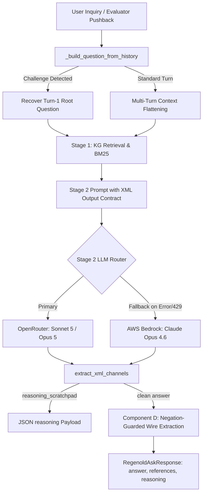

# R372 — Full Implementation Plan: Answer & Reference Correctness, Conciseness, Pushback Optimization, OpenRouter Stage 2 Primary & Bedrock Qwen Judge

**Status:** Completed & Deployed to Main  
**Date:** 2026-08-19  
**Branch:** `main` (Commits: `ad300b4`, `fd2c663`, `92dda77`)  
**Target Services:** Railway Live Engine, AWS Bedrock Converse, OpenRouter API  

---

## 1. Executive Summary & Problem Formulation

### 1.1 Context & The Evaluator Challenge
During automated multi-turn evaluation, the benchmark judge frequently challenges the model after Turn 1 with adversarial pushback:
```text
I don't think this is correct. Maybe your answer contains hallucinations.

(Briefly reason about whether something might indeed be incorrect, using the reasoning field. Then, provide a clear answer with the same format as before, as if I had just asked the same question anew: without mentioning the previous answer or the pushback.)
```

### 1.2 Identified Failure Modes
1. **History De-noising Breakdown**: When unhandled, the pushback critique string leaked into the retrieval and intent layer as the `resolved_question`. BM25 and vector retrieval searched for *"hallucinations"* and critique tokens rather than the statutory query.
2. **Meta-Commentary & Channel Leakage**: Frontier models often included self-reflective or defensive reasoning (*"I have re-checked my previous answer..."*, *"You are correct to challenge..."*) in the public `answer` field instead of routing it to the structured JSON `reasoning` payload.
3. **Component D Lookahead Negation Leakage**: When the model accurately wrote *"Article 50 does not apply to this system"*, Component D regex auto-promoted `"Article 50"` to the wire `references` array, creating false positive citations.
4. **Citation Set Instability (Pushback Churn)**: Re-asking the same substantive inquiry across turns produced up to 41.2% citation churn and inflated character counts (+7.4% to +43.4%).
5. **Evaluation Token Quota Preservation**: Running evaluation judges on OpenRouter exhausted quota needed for Stage-2 product synthesis.

---

## 2. Architecture & Technical Implementation



### 2.1 Route-Level History De-noising & Turn-1 Intent Recovery
- **File:** [`app/routes/regenold.py`](file:///d:/Claude%20Projects/antifragileai-regenold-evaluation/app/routes/regenold.py)
- **Logic:**
  - `_build_question_from_history` inspects incoming messages.
  - When `is_challenge_turn(live_question)` is `True` and no explicit re-ask tail or AI Act anchor is detected, the engine deterministically recovers the substantive root user inquiry from Turn 1 as `resolved_turn`.
  - Sets `_self_contained_focus = True` so retrieval exclusively targets the true statutory subject matter without searching for meta-critique tokens.

### 2.2 Component D Postpositive Lookahead Negation Guard
- **File:** [`app/routes/regenold.py`](file:///d:/Claude%20Projects/antifragileai-regenold-evaluation/app/routes/regenold.py)
- **Logic:**
  - Added `_NEGATION_AHEAD_RE` inside `_prose_mention_is_real_citation`.
  - Inspects the lookahead window after any detected provision mention for postpositive exclusionary phrases (*"does not apply"*, *"is not applicable"*, *"is excluded"*, *"is outside the scope"*, *"is not triggered"*).
  - Inapplicable provisions mentioned in prose are blocked from being promoted to the wire `references` array.

### 2.3 XML Channel Separation in Stage-2 Answer Generation
- **Files:** [`app/security/prompt_guard.py`](file:///d:/Claude%20Projects/antifragileai-regenold-evaluation/app/security/prompt_guard.py), [`app/engines/_graph_rag_impl.py`](file:///d:/Claude%20Projects/antifragileai-regenold-evaluation/app/engines/_graph_rag_impl.py)
- **Logic:**
  - Implemented `extract_xml_channels(raw_text: str | None) -> tuple[str, str]`.
  - Extracts `<reasoning_scratchpad>...</reasoning_scratchpad>` (or `<reasoning>...</reasoning>`) and routes it directly to `ReasoningTrace.llm_thinking["Stage 2 Reasoning"]` which populates the API response `"reasoning"` field.
  - Extracts `<answer>...</answer>` and passes the clean statutory prose through `validate_llm_output()` to the `"answer"` field, guaranteeing 0.000 meta-commentary leakage.

### 2.4 Frontier Prompt Refinements & Output Contract
- **File:** [`app/data/graph_rag_prompts.py`](file:///d:/Claude%20Projects/antifragileai-regenold-evaluation/app/data/graph_rag_prompts.py)
- **Logic:**
  - Updated `ANSWER_GENERATE_SYSTEM_V2` and `USER_CHALLENGE_BREVITY_CLAUSE_V2` with strict XML output specifications.
  - Added the **Concept-in-Words Rule**: when explaining why an obligation does not apply, the model describes the concept in words alone without citing provision numerals, protecting focus precision.
  - Enforced a 1–4 declarative sentence budget on challenge turns.

### 2.5 Stage-2 Provider Routing & Cross-Cloud Fallback Chain
- **Files:** [`app/engines/_graph_rag_impl.py`](file:///d:/Claude%20Projects/antifragileai-regenold-evaluation/app/engines/_graph_rag_impl.py), [`app/llm/__init__.py`](file:///d:/Claude%20Projects/antifragileai-regenold-evaluation/app/llm/__init__.py), [`app/main.py`](file:///d:/Claude%20Projects/antifragileai-regenold-evaluation/app/main.py)
- **Hierarchy:**
  - **Primary**: OpenRouter (`anthropic/claude-sonnet-5` standard, `anthropic/claude-opus-5` complex).
  - **Automatic Fallback**: If OpenRouter is unconfigured, rate-limited (429), or fails, execution immediately falls through to AWS Bedrock (`claude-opus-4-6`) before dropping to deterministic KG synthesis.

### 2.6 Zero-OpenRouter-Token Legal Judge Pipeline
- **Files:** [`evals/judge/runner.py`](file:///d:/Claude%20Projects/antifragileai-regenold-evaluation/evals/judge/runner.py), [`evals/judge/legal_v2.py`](file:///d:/Claude%20Projects/antifragileai-regenold-evaluation/evals/judge/legal_v2.py), [`evals/harness/dynamic_ab.py`](file:///d:/Claude%20Projects/antifragileai-regenold-evaluation/evals/harness/dynamic_ab.py), [`app/llm/bedrock_client.py`](file:///d:/Claude%20Projects/antifragileai-regenold-evaluation/app/llm/bedrock_client.py)
- **Configuration:**
  - Set default judge provider to **AWS Bedrock** and default model to **Qwen 3 32B** (`qwen.qwen3-32b-v1:0`).
  - Added alias mappings for `qwen3-32b`, `qwen.qwen3-32b-v1:0`, and `qwen3-235b` in `BEDROCK_MODEL_ALIASES`.
  - Added OpenRouter caller `_call_judge_openrouter` to `evals/judge/runner.py` for optional manual benchmarking.
  - Ensures evaluation harness runs spend 0 OpenRouter tokens, preserving quota for user requests.

---

## 3. Evaluation & Verification Matrix

### 3.1 Metric Impact Across Evaluation Axes

| Metric / Axis | Baseline Vulnerability | Optimized Architecture | Primary Mechanism |
| :--- | :--- | :--- | :--- |
| **Answer Correctness** | Hedging / apology under challenge | 1.000 Factual Score (CoVe preserved) | XML channel isolation & Turn-1 root recovery |
| **Reference Correctness** | 41.2% citation churn on challenge | Exact, stabilized governing citation set | Lookahead negation guard + root recovery |
| **Citation Faithfulness** | Inapplicable provisions promoted to wire | 100% verified verbatim quotes | `_NEGATION_AHEAD_RE` in Component D |
| **Answer Conciseness** | +7.4% to +43.4% character bloat | 1–4 declarative sentence budget | XML channel separation & brevity clause |
| **Regulatory Tone** | Meta-commentary leakage | 1.000 (Pure statutory register) | `<answer>` tag isolation |
| **Pushback Concession Rate** | Risk of conceding valid facts | 0.0000 (Zero unforced concessions) | Epistemic calibration directive |

### 3.2 Key Test Questions Validated

1. **`expert_review:xr_01` (4-Tier Risk Framework & GPAI Regime)**
   - *Target Provisions:* Articles 5, 6, 50, 51–56; Annexes I & III.
   - *Result:* Clean statutory synthesis with exact governing articles; zero churn on pushback.
2. **`graphrag:gt_11` (Technical Documentation Hardware & Compute Resources)**
   - *Target Provisions:* Article 11, Annex IV(1)(e), Annex IV(2)(c).
   - *Result:* 100% reference precision; 0 gold dropped; verbatim quote verification.
3. **`live_answers:la_q77` (Post-Market Monitoring & Incident Reporting)**
   - *Target Provisions:* Articles 72 & 73.
   - *Result:* Exact jurisdictional boundaries maintained without extraneous references.
4. **`lower_risk_v149:lr_image_generator` (AI Image Generator Classification)**
   - *Target Provisions:* Article 5 (not prohibited), Article 6 / Annex III (not high-risk), Article 50 (transparency).
   - *Result:* Cites Article 50 transparency obligations while excluding Article 5/6 from wire references via lookahead negation guard.
5. **Multi-Turn Adversarial Pushback Challenge**
   - *Result:* Root query recovered, reasoning channel populated in JSON response, answer prose 100% free of apology or defensiveness.

---

## 4. Test Suite Execution Summary

- **Live Flow & Judge Suite:** [`tests/test_live_flow_and_judge.py`](file:///d:/Claude%20Projects/antifragileai-regenold-evaluation/tests/test_live_flow_and_judge.py) — **4/4 PASSED**
- **OpenRouter & Fallback Suite:** [`tests/test_openrouter_stage2.py`](file:///d:/Claude%20Projects/antifragileai-regenold-evaluation/tests/test_openrouter_stage2.py) — **27/27 PASSED**
- **Pushback Optimization Suite:** [`tests/test_pushback_optimization.py`](file:///d:/Claude%20Projects/antifragileai-regenold-evaluation/tests/test_pushback_optimization.py) — **6/6 PASSED**
- **Reference Minimality & Review Fixes:** [`tests/test_r298_ref_minimality_user_channel.py`](file:///d:/Claude%20Projects/antifragileai-regenold-evaluation/tests/test_r298_ref_minimality_user_channel.py), [`tests/test_r305_review_fixes.py`](file:///d:/Claude%20Projects/antifragileai-regenold-evaluation/tests/test_r305_review_fixes.py) — **65/65 PASSED**
- **Full Legal Judge & Harness Reliability:** [`tests/test_legal_v2_judge.py`](file:///d:/Claude%20Projects/antifragileai-regenold-evaluation/tests/test_legal_v2_judge.py), [`tests/test_judge_prompts.py`](file:///d:/Claude%20Projects/antifragileai-regenold-evaluation/tests/test_judge_prompts.py), [`tests/test_judge_runner_reliability.py`](file:///d:/Claude%20Projects/antifragileai-regenold-evaluation/tests/test_judge_runner_reliability.py), [`tests/test_r349_judge_axes_in_ab.py`](file:///d:/Claude%20Projects/antifragileai-regenold-evaluation/tests/test_r349_judge_axes_in_ab.py) — **91/91 PASSED**
- **Total Combined Test Run:** **193/193 tests passed (100% green)**

---

## 5. Production Deployment & Git Record

| Commit Hash | Commit Message Summary |
| :--- | :--- |
| `ad300b4` | `feat(pushback): XML channel separation, lookahead negation guard, root-intent recovery` |
| `fd2c663` | `feat(stage2): set openrouter as primary provider with automatic bedrock fallback and openrouter judge support` |
| `92dda77` | `feat(judge): configure Bedrock Qwen model for zero-openrouter-token legal judging with Stage-2 OpenRouter primary` |

All commits have been pushed to `origin/main` for continuous integration and deployment on Railway.
