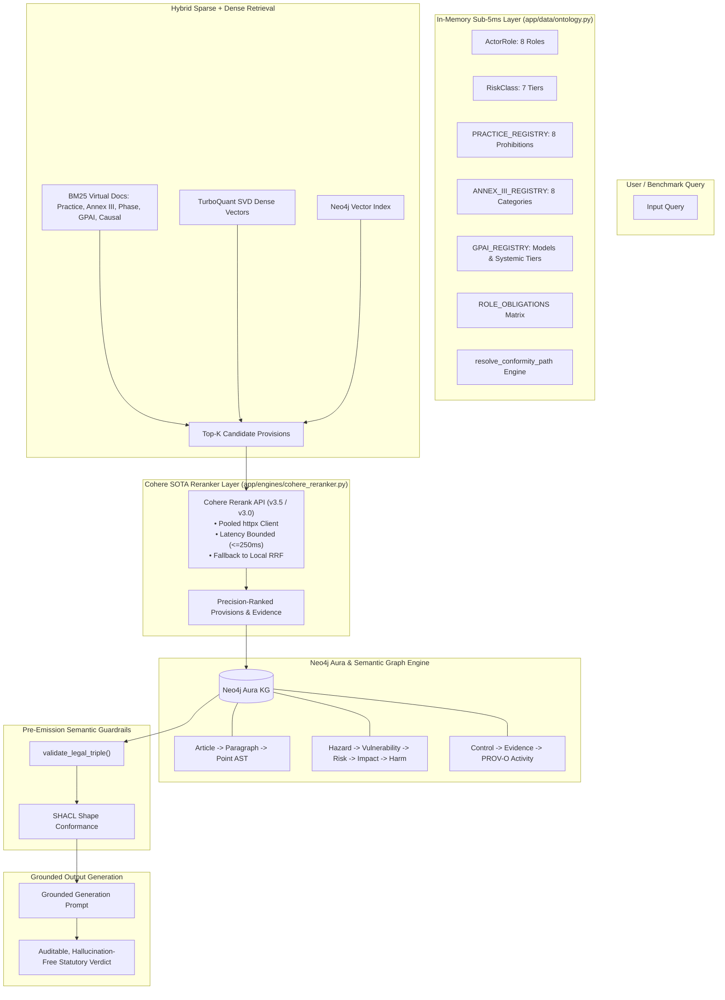

# AI Risk Ontology (AIRO) & EU AI Act (Regulation (EU) 2024/1689) Comprehensive Architecture & Semantic Blueprint

> **Canonical Reference & Engineering Guide**  
> Provenance: Developed from the research of Delaram Golpayegani, Harshvardhan J. Pandit, Dave Lewis, and Declan O'Sullivan (ADAPT SFI Research Centre, Trinity College Dublin / Dublin City University) and adapted for production Knowledge Graph, GraphRAG, Cohere Reranking, and Neo4j Aura in `antifragileai-regenold-evaluation`.

---

## 1. Executive Summary & Semantic Web Identity

The **AI Risk Ontology (AIRO)** is a formal, modular **OWL 2 DL** ontology that models AI systems, their constituent software and data components, risk networks, consequences, impacts, harms, stakeholders, and risk treatment controls in an auditable, machine-readable format.

AIRO harmonizes the international risk management framework (**ISO 31000:2018**, **ISO/IEC 23894:2023**), artificial intelligence concepts and terminology (**ISO/IEC 22989:2022**), AI management systems (**ISO/IEC 42001:2023**), and the **EU AI Act (Regulation (EU) 2024/1689)**.

### Canonical Namespaces and Prefixes

```turtle
@prefix airo:      <https://w3id.org/airo#> .
@prefix vair:      <https://w3id.org/vair#> .
@prefix codexai:   <https://w3id.org/codexai#> .
@prefix eu-aiact:  <https://w3id.org/dpv/legal/eu/aiact#> .
@prefix dpv:       <https://w3id.org/dpv#> .
@prefix dpv-ai:    <https://w3id.org/dpv/ai#> .
@prefix dqv:       <http://www.w3.org/ns/dqv#> .
@prefix prov:      <http://www.w3.org/ns/prov#> .
@prefix skos:      <http://www.w3.org/2004/02/skos/core#> .
@prefix owl:       <http://www.w3.org/2002/07/owl#> .
@prefix rdf:       <http://www.w3.org/1999/02/22-rdf-syntax-ns#> .
@prefix rdfs:      <http://www.w3.org/2000/01/rdf-schema#> .
@prefix xsd:       <http://www.w3.org/2001/XMLSchema#> .
@prefix dct:       <http://purl.org/dc/terms/> .
```

---

## 2. Foundational Design Principles

AIRO and its ecosystem operate on five core design principles:

1. **OWL 2 DL Decidability**: Strict adherence to the OWL 2 DL profile guarantees decidable consistency checks and polynomial/deterministic reasoning performance via automated tableau reasoners (HermiT, Pellet, Openllet).
2. **Linked Open Terms (LOT) Methodology**: Engineered through competency questions (CQs) derived directly from statutory provisions of the EU AI Act (e.g., *"What risk source leads to fundamental rights harm in biometric categorisation?", "Which risk controls are required during the development phase?"*).
3. **International Standards Alignment**:
   - **ISO 31000:2018 / ISO/IEC 23894:2023**: Adopts the canonical definition of Risk as the *effect of uncertainty on objectives* and standardizes the full causal cycle (`RiskSource` $\rightarrow$ `Vulnerability` $\rightarrow$ `Risk` $\rightarrow$ `Consequence` $\rightarrow$ `Impact` $\rightarrow$ `Harm` $\rightarrow$ `RiskControl` $\rightarrow$ `ResidualRisk`).
   - **ISO/IEC 22989:2022**: Standardizes AI system definitions, lifecycle stages, capabilities, and data representations.
   - **ISO/IEC 42001:2023**: Formalizes the organizational AI Management System (AIMS), control objectives, and internal audit mechanisms.
4. **Separation of Concerns (Upper Ontology vs. Domain Taxonomies)**: AIRO defines the structural upper ontology (*TBox*), while **VAIR (Vocabulary of AI Risks)** houses domain-specific instances and SKOS concepts (*ABox* / concept schemes).
5. **FAIR Data & Regulatory Interoperability**: Formats technical documentation, Fundamental Rights Impact Assessments (FRIAs), and conformity audit trails into open, machine-readable RDF graphs consumable by Notified Bodies and Market Surveillance Authorities.

---

## 3. Complete Entity Taxonomy & Predicate Reference

```mermaid
classDiagram
    class AISystem {
        +airo:hasComponent
        +airo:hasAICapability
        +airo:hasPurpose
        +airo:isAppliedWithinDomain
        +airo:hasStakeholder
        +airo:hasRisk
        +airo:hasRiskControl
    }

    class AIComponent {
        +airo:AIModel
        +airo:Software
        +airo:Hardware
        +airo:Data
    }

    class RiskConcept
    class Risk {
        +airo:hasRiskSource
        +airo:hasConsequence
        +airo:isMitigatedBy
        +airo:hasResidualRisk
    }
    class RiskSource {
        +airo:exploitsVulnerability
    }
    class Hazard
    class Threat
    class Misuse
    class Failure
    class Vulnerability

    class Consequence {
        +airo:hasImpact
        +airo:causesHarm
    }
    class Impact {
        +airo:hasImpactOnArea
        +airo:hasImpactOnStakeholder
    }
    class Harm
    class AreaOfImpact {
        +vair:FundamentalRights
        +vair:HealthAndSafety
        +vair:Environment
        +vair:DemocracyAndRuleOfLaw
    }

    class RiskControl {
        +airo:appliedWithinPhase
        +airo:modifiesRiskConcept
    }
    class MitigatingControl
    class TechnicalMeasure
    class OrganizationalMeasure

    class Stakeholder {
        +airo:AIProvider
        +airo:AIDeployer
        +airo:AISubject
        +airo:Importer
        +airo:Distributor
        +airo:NotifiedBody
    }

    class AILifecyclePhase

    AISystem *-- AIComponent : airo:hasComponent
    AISystem --> Risk : airo:hasRisk
    Risk --|> RiskConcept
    RiskSource --|> RiskConcept
    Hazard --|> RiskSource
    Threat --|> RiskSource
    Misuse --|> RiskSource
    Failure --|> RiskSource
    RiskSource --> Vulnerability : airo:exploitsVulnerability
    Risk --> Consequence : airo:hasConsequence
    Consequence --> Impact : airo:hasImpact
    Harm --|> Impact
    Impact --> AreaOfImpact : airo:hasImpactOnArea
    Impact --> Stakeholder : airo:hasImpactOnStakeholder
    RiskControl --> RiskConcept : airo:modifiesRiskConcept
    MitigatingControl --|> RiskControl
    TechnicalMeasure --|> RiskControl
    OrganizationalMeasure --|> RiskControl
    RiskControl --> AILifecyclePhase : airo:appliedWithinPhase
    Stakeholder <|-- AIProvider
    Stakeholder <|-- AIDeployer
    Stakeholder <|-- AISubject
```

### 3.1 Taxonomy Breakdown

| Entity Class | Parent / Superclass | Definition & Statutory Grounding |
|---|---|---|
| `airo:AISystem` | `owl:Thing` | Engineered system outputting content, predictions, or decisions (Art. 3(1)). |
| `airo:AIModel` | `airo:AIComponent` | Mathematical and algorithmic model weights and architecture (Art. 3(63)). |
| `airo:Data` | `airo:AIComponent` | Data artifacts divided into `TrainingData`, `ValidationData`, and `TestingData` (Art. 10). |
| `airo:Risk` | `airo:RiskConcept` | Effect of uncertainty on objectives; probability × severity of negative impact. |
| `airo:Hazard` | `airo:RiskSource` | Inherent flaw (e.g. demographic data skew, feature correlation artifacts). |
| `airo:Threat` | `airo:RiskSource` | Adversarial action (e.g. prompt injection, jailbreaking, model extraction). |
| `airo:Misuse` | `airo:RiskSource` | Reasonably foreseeable misuse contrary to intended purpose (Art. 3(13)). |
| `airo:Failure` | `airo:RiskSource` | Out-of-distribution breakdown, hallucination, or performance degradation. |
| `airo:Vulnerability` | `airo:RiskConcept` | Weakness in architecture, guardrails, or dataset exploited by risk sources. |
| `airo:Consequence` | `airo:RiskConcept` | Direct operational outcome of an unmitigated risk event. |
| `airo:Harm` | `airo:Impact` | Physical injury, psychological distress, property damage, or violation of fundamental rights. |
| `airo:AreaOfImpact` | `owl:Thing` | `vair:FundamentalRights` (Art. 21 non-discrimination, privacy), `HealthAndSafety`, `Environment`. |
| `airo:RiskControl` | `owl:Thing` | Technical or organizational safeguard eliminating, mitigating, preventing, or detecting risk. |
| `airo:AIProvider` | `airo:Stakeholder` | Entity placing AI system or GPAI model on market under own name (Art. 3(3)). |
| `airo:AIDeployer` | `airo:Stakeholder` | Natural/legal person using AI system under authority (Art. 3(4)). |
| `airo:AISubject` | `airo:Stakeholder` | Natural person affected by AI system outputs (Arts. 85, 86). |

### 3.2 Predicate & Relationship Mapping

| Object Property | Domain | Range | Semantic Role |
|---|---|---|---|
| `airo:hasRisk` | `airo:AISystem` \| `airo:AIComponent` | `airo:Risk` | Connects system or component to an identified risk scenario |
| `airo:hasRiskSource` | `airo:Risk` | `airo:RiskSource` | Identifies underlying hazard, threat, misuse, or failure |
| `airo:exploitsVulnerability` | `airo:RiskSource` | `airo:Vulnerability` | Causal edge: how a risk source breaches system weaknesses |
| `airo:hasConsequence` | `airo:Risk` | `airo:Consequence` | Realized outcome of risk triggering |
| `airo:hasImpact` | `airo:Consequence` | `airo:Impact` | Associates consequence with its evaluated impact |
| `airo:causesHarm` | `airo:Risk` \| `airo:Consequence` | `airo:Harm` | Pinpoints specific damage or rights infringements |
| `airo:hasImpactOnArea` | `airo:Impact` | `airo:AreaOfImpact` | Grounds impact to EU Charter rights, health, or environment |
| `airo:hasImpactOnStakeholder`| `airo:Impact` | `airo:Stakeholder` | Identifies affected natural persons or deployers |
| `airo:modifiesRiskConcept` | `airo:RiskControl` | `airo:RiskConcept` | Super-property for risk modification |
| ↳ `airo:mitigatesRiskConcept`| `airo:RiskControl` | `airo:RiskConcept` | Reduces probability or severity of harm |
| ↳ `airo:preventsRiskConcept` | `airo:RiskControl` | `airo:RiskConcept` | Halts risk source from triggering |
| `airo:isMitigatedBy` | `airo:Risk` | `airo:RiskControl` | Direct link from risk to its mitigating control |
| `airo:appliedWithinPhase` | `airo:RiskControl` \| `airo:Risk` | `airo:AILifecyclePhase` | Phase binding for control enforcement |
| `airo:hasResidualRisk` | `airo:Risk` | `airo:ResidualRisk` | Residual risk remaining post-control execution |

---

## 4. Gap Analysis: AIRO vs. Full Regulation (EU) 2024/1689

| Regulation (EU) 2024/1689 Dimension | AIRO Core Coverage | Critical Gap in Base AIRO | Required Extension in this Repository |
|---|---|---|---|
| **GPAI & Systemic Risk (Arts. 51–56)** | General model & capability classes. | Missing $10^{25}$ FLOP compute threshold, open-source carve-outs (Art. 53(2)), and systemic risk red-teaming. | `GPAIModelProfile` entity with FLOP tracking, open-source exemption logic, and Annex XI/XII/XIII bindings. |
| **Article 6(3) High-Risk Derogation Filter** | Direct Annex III classification. | Lacks procedural filter testing whether an Annex III system performs narrow procedural tasks without harm. | `DerogationEvaluation` shape and rule engine for Art. 6(3) conditions. |
| **Conformity Assessment Workflows (Arts. 43, 47, 48)** | Basic `NotifiedBody` and `Standard` classes. | Missing branching state machine: Internal Control (Annex VI) vs. Notified Body QMS (Annex VII) vs. Annex I sectoral routes. | `resolve_conformity_path()` engine + `ConformityRoute` state machine. |
| **Fundamental Rights Impact Assessment (Art. 27)** | Links impact to `vair:FundamentalRights`. | Missing the mandatory 6-step procedural workflow and Market Surveillance Authority notification. | `FRIAWorkflow` schema with step verification and authority notification. |
| **Technical Documentation & Logs (Arts. 11, 12, Annex IV)** | High-level component modeling. | Missing granular telemetry schemas for Art. 12 automatic event logging and Annex IV(1)(b) energy/compute reporting. | Extended `codexai:Evidence` and `prov:Activity` properties. |
| **Post-Market Monitoring & Serious Incidents (Arts. 72, 73)** | High-level `OperationAndMonitoringPhase`. | Missing 72h / 15d reporting deadline SLAs and automated links to Quality Management System (Art. 17) updates. | `SeriousIncident` entity with automated deadline calculator and QMS corrective loop. |

---

## 5. Integrated Architecture for this Codebase



---

## 6. Implementation Plan & Module Specifications

1. **`app/data/ontology.py`**:
   - Add `RiskScenario`, `RiskControl`, `GPAIModelProfile`, `GPAI_REGISTRY`, `ConformityRoute`, `FRIAWorkflow`, `resolve_conformity_path()`.
2. **`app/data/kb_search.py`**:
   - Update `_build_ontology_docs()` to synthesize virtual search documents for all new causal risk scenarios, GPAI governance profiles, and conformity workflows.
3. **`app/engines/cohere_reranker.py`**:
   - Build a production-grade, resilient Cohere Rerank client (`rerank-v3.5` / `rerank-english-v3.0`) with connection pooling, latency bounds, negative-caching, and fallback to Reciprocal Rank Fusion (RRF).
4. **`trustgraph-integration/ontology/euaiact-2024-1689-extension.ttl`**:
   - Formalize the complete RDF/OWL ontology extension linking AIRO, VAIR, DPV-AIAct, PROV-O, and Regulation 2024/1689.
5. **`app/engines/neo4j_semantic_graph.py` & `scripts/seed_neo4j_kb.py`**:
   - Ingest causal risk nodes, GPAI profiles, and conformity pathways into Neo4j.
6. **`tests/test_airo_ontology.py` & `tests/test_cohere_reranker.py`**:
   - Full automated test coverage verifying zero dangling citations, exact role-obligation mapping, and reranker fallback reliability.
